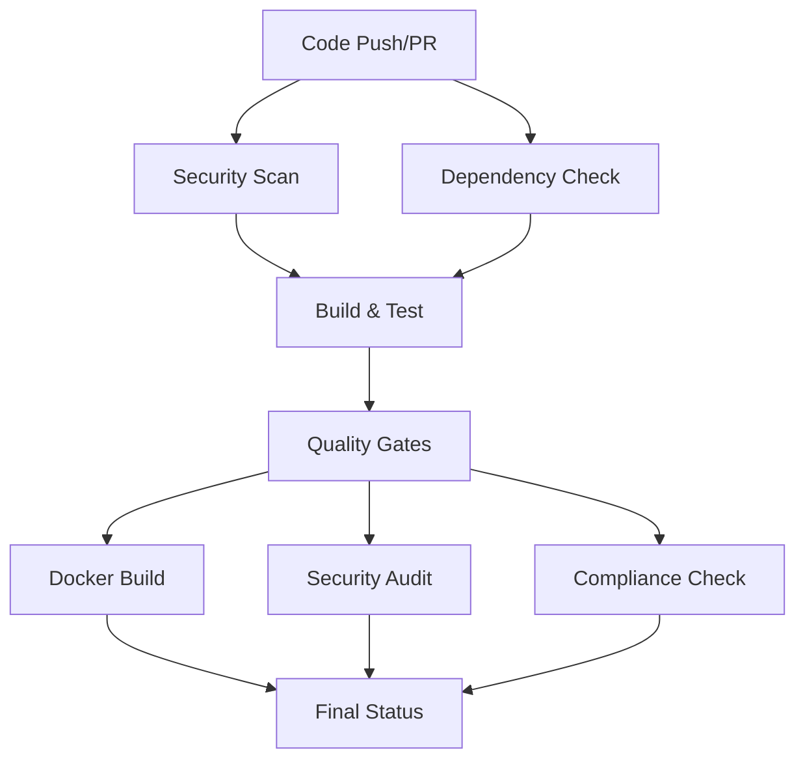

# Secure CI/CD Pipeline for Spring PetClinic

This repository implements a comprehensive, secure CI/CD pipeline using GitHub Actions with industry best practices for security, compliance, and software supply chain management.

## Pipeline Overview

The CI/CD pipeline consists of multiple stages that ensure code quality, security, and compliance:



## Pipeline Stages

### 1. Security Vulnerability Scan
- **Tool**: Trivy
- **Scope**: File system and dependencies
- **Output**: SARIF format for GitHub Security tab
- **Severity**: CRITICAL and HIGH vulnerabilities

### 2. Dependency Vulnerability Check
- **Tool**: OWASP Dependency Check
- **Scope**: Maven dependencies
- **CVSS Threshold**: 7.0 (High and above)
- **Output**: SARIF format

### 3. Build and Test
- **Matrix Strategy**: 
  - Java versions: 17, 21
  - Databases: H2, MySQL, PostgreSQL
- **Steps**:
  - Maven POM validation
  - Code compilation
  - Checkstyle validation
  - Unit and integration tests
  - JaCoCo coverage report
  - SBOM generation (CycloneDX)

### 4. Quality Gates
- **Test Coverage**: Minimum 80%
- **Security Vulnerabilities**: Zero critical issues
- **Code Quality**: Checkstyle compliance

### 5. Docker Build
- **Multi-stage build** with security best practices
- **Multi-architecture**: AMD64 and ARM64
- **Security scanning** of final image
- **Container registry**: GitHub Container Registry

### 6. Security Audit
- **Snyk**: Dependency and code analysis
- **CodeQL**: Static analysis for security vulnerabilities
- **Coverage**: Java language support

### 7. Compliance and Audit
- **License compliance** checking
- **Dependency tree** generation
- **Compliance report** generation
- **Artifact tracking**

## Configuration

### Environment Variables

```yaml
JAVA_VERSION: '17'
MAVEN_VERSION: '3.9.6'
DOCKER_IMAGE: 'spring-petclinic'
REGISTRY: 'ghcr.io'
IMAGE_NAME: ${{ github.repository }}
```

### Required Secrets

```yaml
GITHUB_TOKEN: # Automatically provided
SNYK_TOKEN: # Required for Snyk security scanning
```

### Branch Protection Rules

Configure these rules in your repository settings:

```yaml
# Required status checks
- ci-pipeline
- dependency-update

# Required reviews
- Require pull request reviews before merging
- Require review from code owners
- Dismiss stale reviews when new commits are pushed

# Restrictions
- Restrict pushes that create files
- Require linear history
```

## Docker Configuration

### Multi-stage Dockerfile

The Dockerfile implements security best practices:

- **Non-root user**: Application runs as `appuser:appgroup`
- **Minimal base image**: Alpine Linux for smaller attack surface
- **Security updates**: Regular package updates
- **Health checks**: Application health monitoring
- **Resource limits**: JVM memory configuration

### Build Commands

```bash
# Build for multiple architectures
docker buildx build --platform linux/amd64,linux/arm64 .

# Build with security scanning
docker buildx build --platform linux/amd64,linux/arm64 . && \
docker run --rm -v /var/run/docker.sock:/var/run/docker.sock \
  aquasec/trivy image your-image:tag
```

## Security Features

### Vulnerability Scanning

1. **Trivy**: File system and container image scanning
2. **OWASP Dependency Check**: Maven dependency analysis
3. **Snyk**: Advanced security analysis
4. **CodeQL**: GitHub's semantic code analysis

### Dependency Management

- **Automated updates**: Weekly dependency checks
- **Security patches**: Automatic vulnerability fixes
- **SBOM generation**: CycloneDX format for supply chain transparency
- **License compliance**: Automated license checking

### Access Control

- **Principle of least privilege**: Minimal required permissions
- **Token rotation**: Regular secret updates
- **Audit logging**: All actions logged and tracked

## Quality Gates

### Test Coverage
- **Minimum**: 80% line coverage
- **Tool**: JaCoCo
- **Enforcement**: Pipeline fails if threshold not met

### Security Thresholds
- **Critical vulnerabilities**: 0 (zero tolerance)
- **High vulnerabilities**: 0 (zero tolerance)
- **Medium vulnerabilities**: Reviewed case-by-case

### Code Quality
- **Checkstyle**: Enforces coding standards
- **Spring Java Format**: Consistent code formatting
- **No HTTP**: Prevents insecure HTTP usage

## Incident Response

### Security Breach Response

1. **Immediate**: Stop affected services
2. **Assessment**: Evaluate scope and impact
3. **Containment**: Isolate affected systems
4. **Eradication**: Remove threat
5. **Recovery**: Restore services
6. **Lessons Learned**: Document and improve

### Rollback Procedures

```bash
# Rollback to previous version
git revert HEAD
docker pull ghcr.io/your-repo/spring-petclinic:previous-tag
docker-compose down && docker-compose up -d
```

## Monitoring and Metrics

### Key Performance Indicators

- **Build Success Rate**: Target > 95%
- **Security Scan Pass Rate**: Target 100%
- **Test Coverage**: Target > 80%
- **Deployment Frequency**: Target daily
- **Lead Time**: Target < 1 hour

### Dashboards

- **GitHub Security**: Vulnerability tracking
- **Codecov**: Test coverage metrics
- **Docker Hub**: Image security scanning
- **GitHub Actions**: Pipeline performance

## Troubleshooting

### Common Issues

#### Build Failures
```bash
# Clean and rebuild
./mvnw clean package

# Check Java version
java -version

# Verify Maven wrapper
./mvnw --version
```

#### Security Scan Failures
```bash
# Update dependencies
./mvnw versions:use-latest-releases

# Check for known issues
./mvnw org.owasp:dependency-check-maven:check

# Review suppression file
cat suppression.xml
```

#### Docker Build Issues
```bash
# Check Docker daemon
docker info

# Verify build context
docker build --no-cache .

# Check image layers
docker history your-image:tag
```

### Debug Mode

Enable debug logging in GitHub Actions:

```yaml
- name: Debug
  run: |
    echo "Repository: ${{ github.repository }}"
    echo "Branch: ${{ github.ref_name }}"
    echo "Commit: ${{ github.sha }}"
    echo "Event: ${{ github.event_name }}"
```

## Continuous Improvement

### Regular Reviews

- **Monthly**: Security policy review
- **Quarterly**: Pipeline performance analysis
- **Annually**: Security framework updates

### Feedback Loop

- **Automated**: Pipeline metrics collection
- **Manual**: Team retrospectives
- **External**: Security audits and penetration testing

## Resources

### Documentation
- [GitHub Actions Documentation](https://docs.github.com/en/actions)
- [OWASP Dependency Check](https://owasp.org/www-project-dependency-check/)
- [Trivy Documentation](https://aquasecurity.github.io/trivy/)
- [CycloneDX Specification](https://cyclonedx.org/specification/)

### Security Standards
- [OWASP Top 10](https://owasp.org/www-project-top-ten/)
- [NIST Cybersecurity Framework](https://www.nist.gov/cyberframework)
- [ISO 27001](https://www.iso.org/isoiec-27001-information-security.html)

### Best Practices
- [GitHub Security Best Practices](https://docs.github.com/en/github/managing-security-vulnerabilities)
- [Docker Security Best Practices](https://docs.docker.com/develop/dev-best-practices/)
- [Maven Security Best Practices](https://maven.apache.org/guides/security/)

### Reporting Issues

- **Security vulnerabilities**: Email security@thedignified.co
- **Pipeline issues**: Create GitHub issue with `[CI/CD]` label
- **Documentation**: Create GitHub issue with `[docs]` label

## License

This CI/CD pipeline is licensed under the same license as the main project (Apache License 2.0).

## Support

For questions or support:

- **Documentation**: Check this README and linked resources
- **Issues**: Create GitHub issues for bugs or feature requests
- **Security**: Email security@thedignified.co for security concerns
- **Community**: Join our community discussions

---

**Remember**: Security is everyone's responsibility. Stay vigilant and report any concerns immediately.
